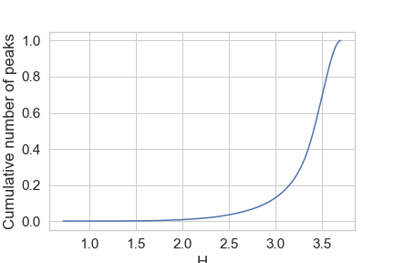
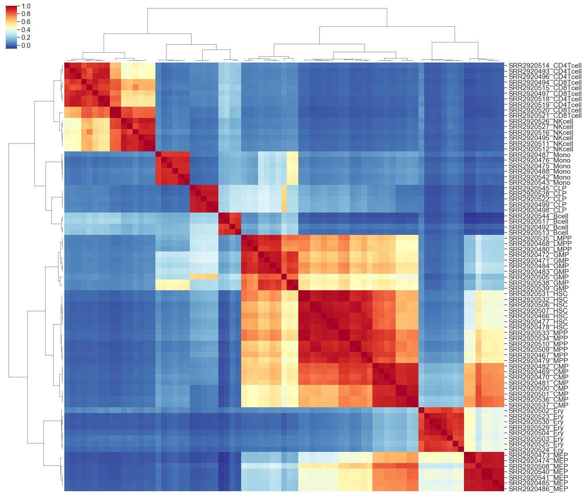
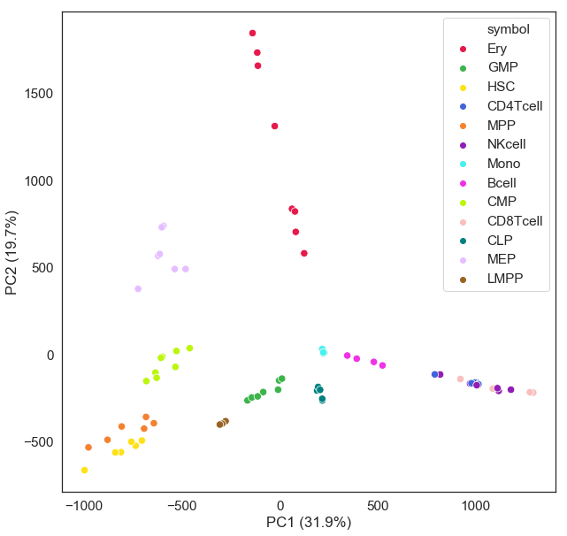

# Tissue-specific ATAC-seq peaks

In this repo, we provide Ery-specific and universal open chroamtin regions from an analysis 13 blood cell types, including 77 ATAC-seq data from `PRJNA301969`. Analysis method is adopted from: https://www.nature.com/articles/s41597-019-0071-0.pdf. Our code is provided in `get_tissue_specific_peaks.ipynb`. Briefly, ATAC-seq raw fastq files were downloaded from NCBI SRA using `sra_download.py`, ATAC-seq data was processed using `HemTools atac_seq`, and read count table was generated using `diffPeaks.py`. The output table is `DiffPeak_yli11_2020-01-28.count_table.zip`.

# Results

### Distribution of tissue specificity index



### Tissue-specificity definition

```

H <= 3: Tissue-specific ATAC-seq peaks, containing 4518 peaks

H >= 3.5: Universal open chromatin

```
### Correlation of the 77 ATAC-seq data using tissue-specific peaks



### PCA plot of the 77 ATAC-seq data using tissue-specific peaks



